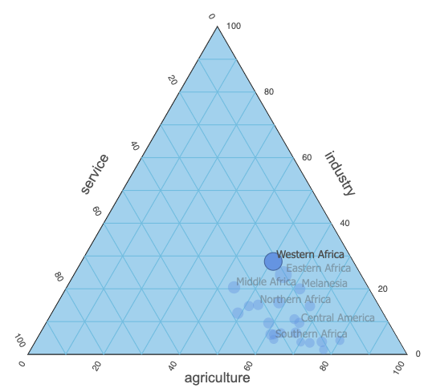

# Ternary

## Description
The Ternary visualization shows a chart that positions data points inside a triangle. The location of a data point is determined by the relative contribution of each of three values to the total of these values. The relative contribution is used as the scale for each of the three edges of a triangle.

For instance the data point [ 10, 15, 30 ] will be positioned on 10 / 55 = 18% of the first axis, 15 / 55 = 27% of the second axis and 30 / 55 = 55% of the third axis.

**Note:** This sample is **not supported** on IE 11 browsers.

## Objective
This example illustrates the following concepts:
- Enabling or disabling properties based on the value of another property.
- Changing render behaviour for small size visualizations.
- Applying highlight and selection styling.
- Storing text in a resource file for possible translation.
- Using an external javascript library ('RBush' for label overlapping).
- Separating render logic from data handling as a coding pattern.
- Memory efficient rendering by using accessor functions for calculations.
- Using UpdateInfo.reason for render optimization.

## Files
- [`renderer/Main.ts`](./renderer/Main.ts) - Entry point, containing the RenderBase implementation. Contains the rendering code to draw the chart.
- [`renderer/Ternary.ts`](./renderer/Ternary.ts) - Abstract implementation of a ternary visualization. Contains only data structures and is independent on any rendering library.
- [`renderer/Geometry.ts`](./renderer/Geometry.ts) - A couple of geometry helper classes, like Pt2d, Rect2d, Edge and Triangle. Used only in Ternary.ts.

## Example

